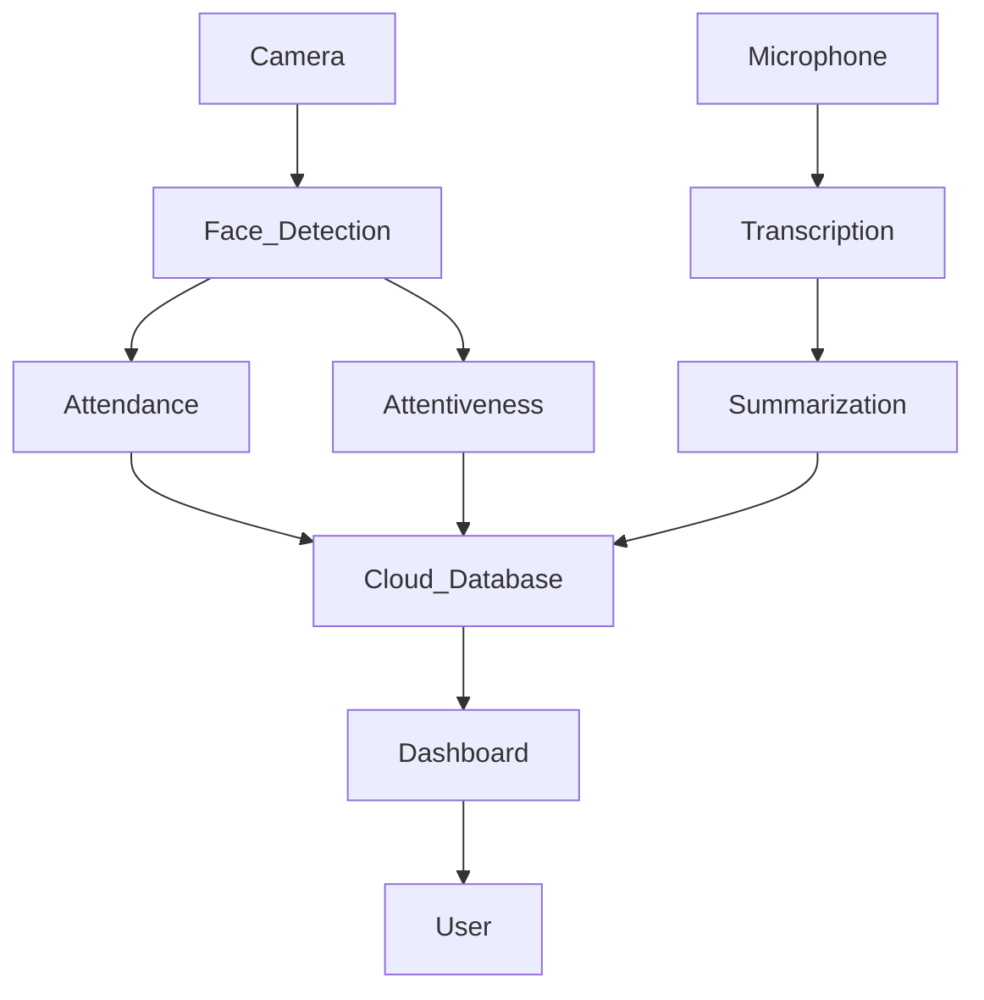

trying out deepface - [VGG-Face , FaceNet, OpenFace, DeepFace, DeepID, ArcFace, Dlib]

choco install ffmpeg

sudo apt install ffmpeg -y

concurrent.futures

# **Classroom Monitoring System**

## **Overview**

This project aims to enhance classroom monitoring through **computer vision and natural language processing**. The system leverages a **camera module and microphone** to track student attendance, attentiveness, and generate structured lecture notes.

## **Features**

✅ **Face Recognition for Attendance**  
✅ **Attentiveness Tracking**  
✅ **Audio Transcription & Summarization**  
✅ **Cloud Storage & Dashboard**  
✅ **Streamlit-Based UI**

## **Technology Stack**

- **Computer Vision**: YuNet (OpenCV), YOLOv11 (Face Recognition)
- **Deep Learning**: Custom **facial points-based model** (planned)
- **Transcription**: **Speech-to-Text LLM**
- **Database**: Cloud-based CSV storage
- **Web UI**: Streamlit

## **System Architecture**



## **Setup & Installation**

1. Clone the repository:
   ```bash
   git clone <repo-url>
   ```
2. Install dependencies:
   ```bash
   # Add installation commands here
   ```
3. Run the Streamlit app:
   ```bash
   # Add command to start the Streamlit app
   ```

## **Usage Instructions**

1. **Start the system** to record classroom sessions.
2. **Monitor attendance** and **attentiveness** via the dashboard.
3. **Review transcribed notes** generated by the LLM.
4. **Analyze student engagement trends** over time.

## **Demo**

🎥 **Streamlit UI Demo Video:** _(Insert link here)_

## **Results & Observations**

- **Accuracy of face recognition**: _(Add metrics here)_
- **Effectiveness of attentiveness tracking**: _(Add insights here)_
- **Quality of generated lecture notes**: _(Summarize results here)_

## **Future Improvements**

🔹 Switch from YOLOv11 to a **facial points-based model** for improved recognition.  
🔹 Optimize **LLM transcription and summarization**.  
🔹 Implement **real-time alerts** for student inattentiveness.

## **Contributors**

- **Manodeep Ray** _(Project Lead)_
- _(Add more team members if any)_

## **License**

This project is licensed under the CC License.
