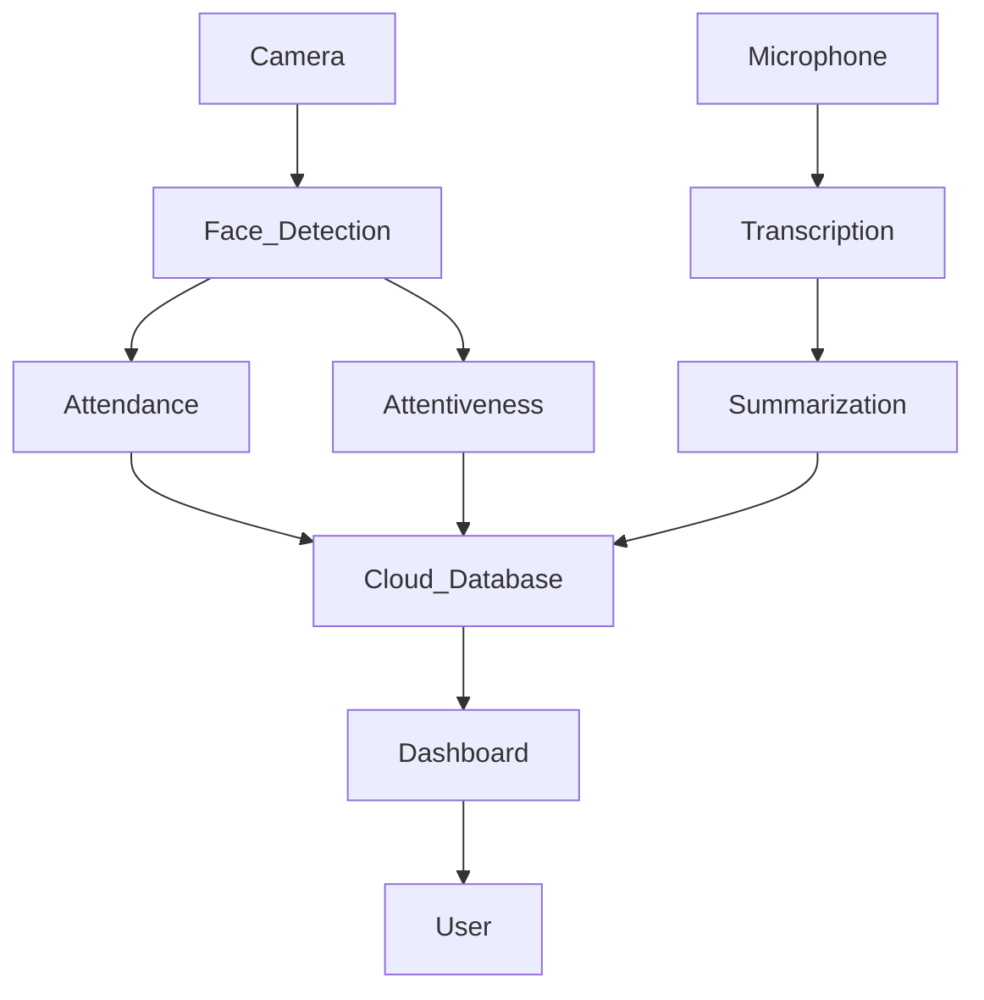

Thanks for the clarification! I've updated the environment variable to `GROQ_LLM_MODEL_ID` and added a step for creating a virtual environment under **Setup & Installation**. Here's the revised version:

---

# **Classroom Monitoring System**

A deployable, AI-powered classroom monitoring solution using **Computer Vision** and **Natural Language Processing**. It captures **attendance**, tracks **student attentiveness**, and auto-generates **lecture notes** from classroom sessions.

---

## **Features**

✅ **Face Detection and Recognition for Attendance**  
✅ **Attentiveness Tracking**  
✅ **Audio Transcription & Summarization**  
✅ **Deployable Server-Based Pipeline**  
✅ **Streamlit-Based Demo UI**

---

## **Technology Stack**

- **Computer Vision**: YuNet (OpenCV), YOLOv11 for face detection  
- **Deep Learning**: Custom facial points-based model *(planned)*  
- **Transcription**: [Vosk Small EN](https://alphacephei.com/vosk/models) (vosk-model-small-en-us-0.15)  
- **Summarization**: LLM via [Groq](https://groq.com/) (`llama3-8b-8192`)  
- **Database**: Cloud-based CSV (PostgreSQL planned)  
- **Web UI**: Streamlit  
- **Deployment**: Lightning AI (UI), Flask + ngrok (server)  

---

## **System Architecture**



---

## **Setup & Installation**

1. Clone the repository:
   ```bash
   git clone https://github.com/manodeepray/minor_project
   cd minor_project
   ```

2. (Recommended) Create and activate a virtual environment:
   ```bash
   python3 -m venv venv
   source venv/bin/activate  # For Linux/macOS
   venv\Scripts\activate     # For Windows
   ```

3. Install dependencies:
   ```bash
   pip install -r requirements.txt
   ```

4. Install system packages:
   - **Linux**
     ```bash
     sudo apt install ffmpeg -y
     ```
   - **Windows (Powershell)**  
     Download and install from [FFmpeg.org](https://ffmpeg.org/)

5. (Optional) Install `tmux` for background terminal session management:
   ```bash
   sudo apt install tmux
   ```

6. Create a `.env` file and add your Groq API key:
   ```
   GROQ_API_KEY="YOUR_API_KEY"
   ```

---

## **Usage Instructions**

### 🔹 **Training the Face Recognition Model**

1. Add your dataset (folder of names with their face images).  
2. Update the dataset path in `src/training/train_face_rec.py`.  
3. Generate YOLO-compatible dataset:
   ```bash
   python src/training/get_training_data.py
   ```

4. Train the model:
   ```bash
   bash scripts/train.sh
   ```

---

### 🔹 **Running the Server Pipeline**

1. Ensure `tmux` is installed (optional).  
2. Start the servers:
   ```bash
   bash scripts/run_servers.sh
   ```
   Or manually in separate terminals:
   ```bash
   python processor.py
   python server.py
   ```

3. Expose your local Flask server to edge devices:
   ```bash
   ngrok http 5000
   ```

---

### 🔹 **LLM Configuration (Optional)**

To change the summarization LLM or prompt behavior, edit:
```python
# src/pipelines/core/llm_integration.py
GROQ_LLM_MODEL_ID = "llama3-8b-8192"
```

Modify the prompt inside:
```python
# src/pipelines/core/llm_integration.py
def generate_notes(...):
    prompt = f"""
    Please summarize the main points and create structured class notes, including key topics, subpoints, and any important details in an .md format

    1. I want to store them in a .md file
    2. If no context, write: "No transcription found"
    context: 
    {transcription}
    """
```

---

### 🔹 **Streamlit UIs**

- Full system demo:
  ```bash
  streamlit run apps/demo_app.py
  ```

- Explore saved data:
  ```bash
  streamlit run apps/files_ui.py
  ```

---

## **Results & Observations**

- **Face Recognition Accuracy**: **91.67% (Top-1)**  
- **Attentiveness Tracking**:  
  ```
  Attentiveness = (frames student is visible) / (total frames in session)
  ```

- **Lecture Note Quality**:  
  Subjective human evaluations based on prompt quality and LLM output

---

## **Future Improvements**

🔹 Integrate custom **facial points-based model** for better recognition  
🔹 Switch to more robust LLMs and refine summarization prompts  
🔹 Enable **real-time alerts** for low attentiveness scenarios  
🔹 Improve PostgreSQL support for real-time dashboards  

---


## **Contributors**

- **Manodeep Ray** _(Project Lead)_

---

## **License**

This project is licensed under the **Creative Commons (CC)** License.

---
